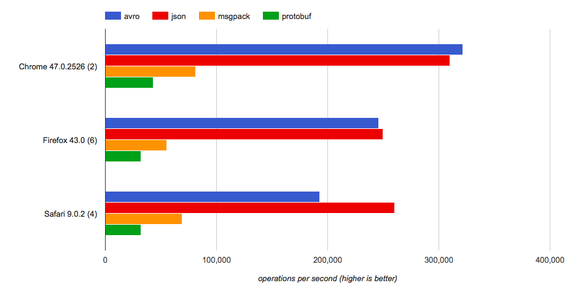
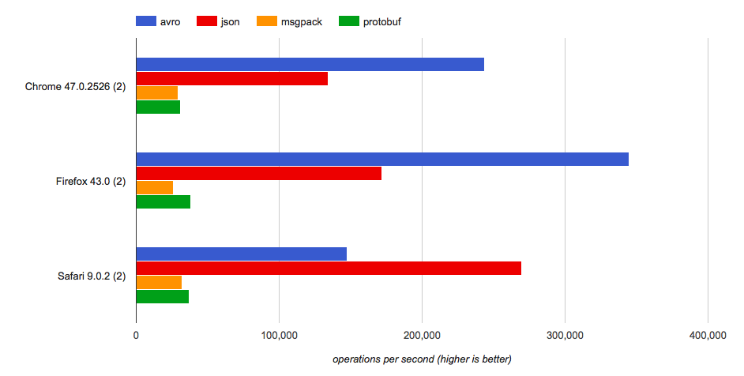

<!-- START doctoc generated TOC please keep comment here to allow auto update -->
<!-- DON'T EDIT THIS SECTION, INSTEAD RE-RUN doctoc TO UPDATE -->


- [JavaScript serialization libraries](#javascript-serialization-libraries)
  - [Node.js throughputs](#nodejs-throughputs)
  - [Browser throughputs](#browser-throughputs)
    - [Decoding](#decoding)
    - [Encoding](#encoding)
  - [Encoding sizes](#encoding-sizes)
- [Avro implementations](#avro-implementations)
    - [Decoding](#decoding-1)
    - [Encoding](#encoding-1)

<!-- END doctoc generated TOC please keep comment here to allow auto update -->

# JavaScript serialization libraries

Libraries compared:

+ `node-avsc`, this package.
+ `node-json`, built-in JSON serializer.
+ [`node-protobuf`](https://www.npmjs.com/package/protobufjs), most popular
  Protocol Buffers implementation.
+ [`node-pson`](https://www.npmjs.com/package/pson), alternative to JSON.
+ [`node-msgpack`](https://www.npmjs.com/package/msgpack-lite), official
  MessagePack implementation.

We show below representative throughput rates (higher is better) for processing
a [realistic record schema][coupon-schema], modeled after a popular open-source
API. The code to reproduce these results is available in
`etc/benchmarks/js-serialization-libraries/`.


## Node.js throughputs

As of `3.0.0` (`3f7a977`).


## Browser throughputs

As of `3.2.1` (`c67aef9`). The original benchmarks are available by clicking on
the charts below.


### Decoding

[](http://jsperf.com/avsc-decode-coupon/2)


### Encoding

[](http://jsperf.com/avsc-encode-coupon/2)


## Encoding sizes

For completeness, the average encoding sizes for this schema are displayed in
the table below.

Encoding | Size (bytes) | % of max
-------- | ------------ | --------
Avro | 71 | 20%
JSON | 359 | 100%
Protobuf | 85 | 24%
PSON | 124 | 35%
MessagePack | 231 | 64%


# Avro implementations

The tables below should throughput rates (records per second, higher is
better). They were computed over 150,000 records, taking the median of 15 runs.
Percentages are relative to the fastest throughput for the schema. All
benchmarks were run on a MacBook Air (1.7GHz Intel Core i7). The code is
available in `etc/benchmarks/avro-serialization-implementations/`. `-1` values
indicate that the library doesn't support the schema.

As of `3.0.0` (`7bc3503`).

### Decoding

```
library          java-avro      node-avsc      python-avro    ruby-avro
                       ops    %       ops    %         ops  %       ops  %
schema
ArrayString.avsc   2000000  100   1266530   63       21164  1     58700  3
Bytes.avsc         4601227  100   1801376   39       60665  1    217912  5
Cake.avsc           452216  100    256442   57        2974  1      7683  2
Coupon.avsc        1877347  100    769071   41        8908  0     22245  1
Double.avsc        6198347   95   6532007  100       40843  1    229785  4
Enum.avsc          4792332   29  16794592  100       53190  0    199045  1
HistoryItem.avsc   1023891  100   1001385   98        4952  0     14898  1
Human.avsc         2377179  100    968227   41       14835  1     42146  2
Int.avsc           4901961   30  16257795  100       60006  0    190781  1
Long.avsc          5300353   42  12539456  100       52885  0    153929  1
PciEvent.avsc       196104  100    101511   52        1285  1      3527  2
Person.avsc        2846300   27  10644791  100       21589  0     66213  1
String.avsc        4901961  100   3761433   77       62766  1    207224  4
Union.avsc         3768844   58   6476772  100       37964  1    135492  2
User.avsc           638570  100    570437   89        2488  0      5868  1
```

### Encoding

```
library          java-avro      node-avsc      python-avro    ruby-avro
                       ops    %       ops    %         ops  %       ops   %
schema
ArrayString.avsc    809935  100    394226   49       23023  3     84439  10
Bytes.avsc         1498501  100   1356937   91       66168  4    145516  10
Cake.avsc           136799  100    132264   97        3732  3      5867   4
Coupon.avsc         669643  100    400925   60       12057  2     13894   2
Double.avsc        1564129   95   1651538  100       54656  3    160231  10
Enum.avsc          1479290  100   1320349   89       67877  5    287977  19
HistoryItem.avsc    349650   90    388593  100        6724  2      8363   2
Human.avsc          746640  100    511139   68       18434  2     34216   5
Int.avsc           1518219   78   1940986  100       83612  4    129737   7
Long.avsc          1559252   85   1824444  100       67836  4     72847   4
PciEvent.avsc        64097  100     59451   93        1482  2      2689   4
Person.avsc        1139818  100   1044261   92       27804  2     61715   5
String.avsc        1477833  100    975808   66       66754  5    271025  18
Union.avsc         1262626  100   1075132   85       44135  3    130373  10
User.avsc           153453   50    305900  100        2886  1      3104   1
```

[coupon-schema]: https://raw.githubusercontent.com/mtth/avsc/master/etc/schemas/Coupon.avsc
